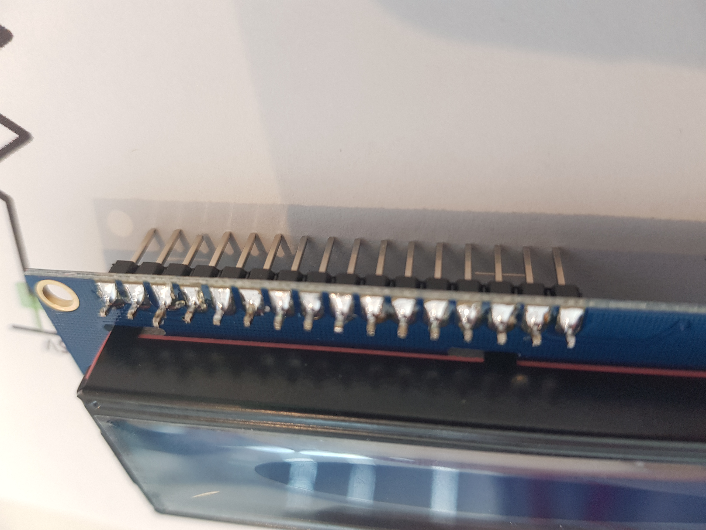
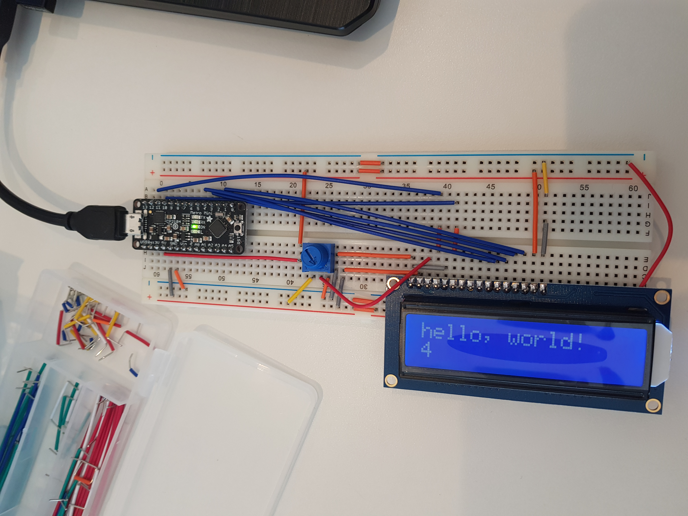

# Digital Timer
 
Include your responses to the bold questions below. Include snippets of code that explain what you did. Deliverables are due next Tuesday. Post your lab reports as README.md pages on your GitHub, and post a link to that on your main class hub page.

## Part A. Solder your LCD panel

Image of header pins soldered into LCD display.



Image of LCD on breadboard working.


## Part B. Writing to the LCD

Image of LCD on breadboard working.

 
**a. What voltage level do you need to power your display?**

The display is powered by 5V

**b. What voltage level do you need to power the display backlight?**

The backlight is powered by 3.3V
   
**c. What was one mistake you made when wiring up the display? How did you fix it?**

I accidently conected DB4 to IO6. Then when I switched DB4 to IO5 and then the LCD display worked perfectly.

**d. What line of code do you need to change to make it flash your name instead of "Hello World"?**

Changed ```lcd.print("hello, world!");``` to ```lcd.print("FJ Fourie");```

Image of LCD display displaying  name and surname.

 
**e. Include a copy of your Lowly Multimeter code in your lab write-up.**

The following is my lowly Multimeter code. It displays the Analog read value that is between 0 and 1023 witch is between 0V and 5V. The .ino file is included in my lab repo in the code folder.
```
#include <LiquidCrystal.h>

const int rs = 12, en = 11, d4 = 5, d5 = 4, d6 = 3, d7 = 2;
LiquidCrystal lcd(rs, en, d4, d5, d6, d7);

int sensorPin = A0;    
int ledPin = 13;      
int sensorValue = 0;
float Voltage_Value = 0;
String Voltage_String;
String equal;

void setup() {
  lcd.begin(16, 2);
  pinMode(ledPin, OUTPUT);
  Serial.begin(9600);
  equal = '=';
}

void loop() { 
  sensorValue = analogRead(sensorPin);
  Voltage_Value = sensorValue * (5.0 / 1023.0);
  Voltage_String = String(Voltage_Value) + 'V';
  
  
  lcd.setCursor(0, 0);
  lcd.print(sensorValue);

  lcd.setCursor(5, 0);
  lcd.print(equal);

  lcd.setCursor(7, 0);
  lcd.print(Voltage_String);
  
  lcd.setCursor(0, 1);
  lcd.print(millis()/1000);
  delay(200);
  lcd.clear();
  
}
```

Image of the above code running with the lcd display showing the voltage.


## Part C. Using a time-based digital sensor

Video of Rotary Encoder Working : 
https://youtu.be/rNx_2c0eS5Y


## Part D. Make your Arduino sing!

**a. How would you change the code to make the song play twice as fast?**

You would half the value of the noteDuration variable and half the value of the pauseBetweenNotes. This will make that every note is played in half the time and the pauses is half the length making the song play twice as fast . Changing it from ``` int noteDuration = 1000 ``` to ``` int noteDuration = 500 ``` and ``` pauseBetweenNotes = noteDuration * 1.3; ``` to ``` pauseBetweenNotes = noteDuration * 0.65; ```
 
**b. What song is playing?**

The song playing is the star wars theme song.


## Part E. Make your own timer

**a. Make a short video showing how your timer works, and what happens when time is up!**

For the make your own timer part of the lab I decided to make a chess clock. It is a clock with 2 timers and 3 buttons and a speaker. Each player gets a set amount of time in this case I gave everyone 10 seconds because I didn't want to wait to long. Then when the one player finishes his turn he presses his button and the other players time starts to run down and visa versa. The middle button can be pressed to reset the clock. When a players timer reaches 0 the speaker plays a tune to inform both players that one has lost based on having no time left.

The following is a link to a video of my timer project: https://youtu.be/HAB-d9v-WmI

The following is my code for the project. I have also uploaded the .ino file in the code folder of my lab2 repo.
```
#include <LiquidCrystal.h>
#include "pitches.h"

#define BTN1_PIN 6
#define BTN2_PIN 7
#define BTN3_PIN 9

const int rs = 12, en = 11, d4 = 5, d5 = 4, d6 = 3, d7 = 2;
LiquidCrystal lcd(rs, en, d4, d5, d6, d7);

int melody[] = {
  NOTE_C4, NOTE_G3, NOTE_G3, NOTE_A3, NOTE_G3, 0, NOTE_B3, NOTE_C4
};

// note durations: 4 = quarter note, 8 = eighth note, etc.:
int noteDurations[] = {
  4, 8, 8, 4, 4, 4, 4, 4
};

float Time1 = 10;
float Time2 = 10;
int flag = 0;
long int Timer = 0;

void setup()   {
  lcd.begin(16, 2);     
  pinMode(BTN1_PIN, INPUT);
  pinMode(BTN2_PIN, INPUT); 
  pinMode(BTN3_PIN, INPUT);  
  Serial.begin(9600);

  lcd.setCursor(0, 0);
  lcd.print(Time1);

  lcd.setCursor(8, 0);
  lcd.print(Time2);
  
}

void loop() {
  if(buttonPressed(BTN1_PIN)) {
    flag = 1;
    Timer = millis();
  }
  if(buttonPressed(BTN2_PIN)) {
    flag = 2;
    Timer = millis();
  }
  if (flag == 2){
    Time2 = Time2 - abs((0.001 * (millis() - Timer)));
    Timer = millis();
    lcd.setCursor(8, 0);
    lcd.print(Time2);
    if (Time2 <= 0){
      flag = 3;
    }
  }
  if (flag == 1){
    Time1 = Time1 - abs((0.001 * (millis() - Timer)));
    Timer = millis();
    lcd.setCursor(0, 0);
    lcd.print(Time1);
    if (Time1 <= 0){
      flag = 3;
    }
  }
  if (flag == 3){
    for (int thisNote = 0; thisNote < 8; thisNote++) {

    // to calculate the note duration, take one second divided by the note type.
    //e.g. quarter note = 1000 / 4, eighth note = 1000/8, etc.
    int noteDuration = 1000 / noteDurations[thisNote];
    tone(8, melody[thisNote], noteDuration);

    // to distinguish the notes, set a minimum time between them.
    // the note's duration + 30% seems to work well:
    int pauseBetweenNotes = noteDuration * 1.30;
    delay(pauseBetweenNotes);
    // stop the tone playing:
    noTone(8);
  }
    Time1 = 10;
    Time2 = 10;
    lcd.clear();
    
    lcd.setCursor(0, 0);
    lcd.print(Time1);

    lcd.setCursor(8, 0);
    lcd.print(Time2);
    flag = 0;
  }
  if(buttonPressed(BTN3_PIN)) {
    Time1 = 10;
    Time2 = 10;
    lcd.clear();
    flag = 0;
    
    lcd.setCursor(0, 0);
    lcd.print(Time1);

    lcd.setCursor(8, 0);
    lcd.print(Time2);
  }
}

// Generic function to check if a button is pressed
int buttonPressed(uint8_t button) {
  static uint16_t lastStates = 0;
  uint8_t state = digitalRead(button);
  if (state != ((lastStates >> button) & 1)) {
    lastStates ^= 1 << button;
    return state == HIGH;
  }
  return false;
}
```


**b. Post a link to the completed lab report your class hub GitHub repo.**
