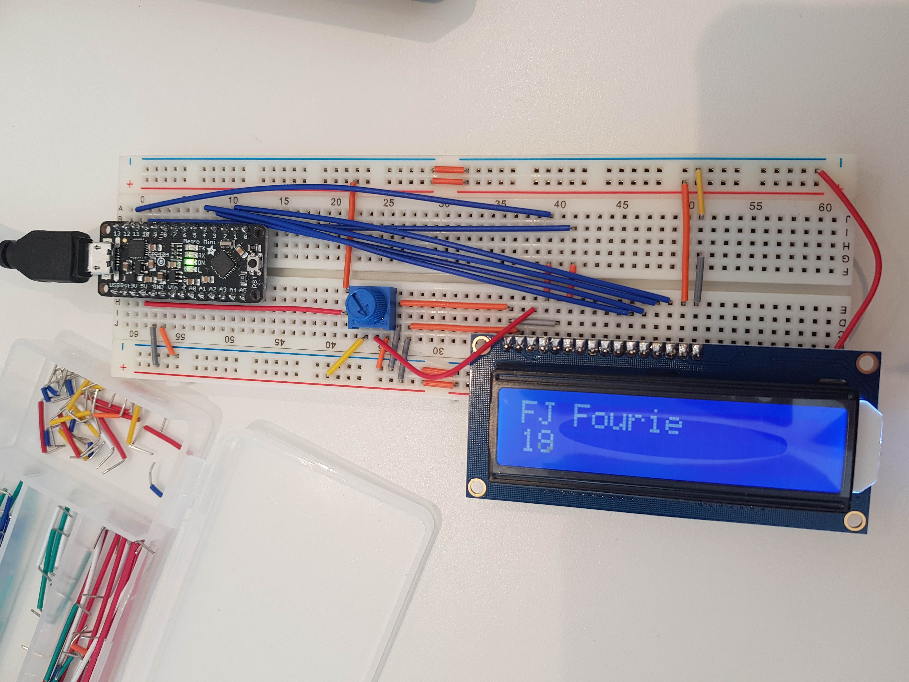

# Digital Timer
 
Include your responses to the bold questions below. Include snippets of code that explain what you did. Deliverables are due next Tuesday. Post your lab reports as README.md pages on your GitHub, and post a link to that on your main class hub page.

## Part A. Solder your LCD panel

Image of header pins soldered into LCD display.


Image of LCD on breadboard working.


## Part B. Writing to the LCD

Image of LCD on breadboard working.

 
**a. What voltage level do you need to power your display?**

The display is powered by 5V

**b. What voltage level do you need to power the display backlight?**

The backlight is powered by 3.3V
   
**c. What was one mistake you made when wiring up the display? How did you fix it?**

I accidently conected DB4 to IO6. Then when I switched DB4 to IO5 and then the LCD display worked perfectly.

**d. What line of code do you need to change to make it flash your name instead of "Hello World"?**

Changed ```lcd.print("hello, world!");``` to ```lcd.print("FJ Fourie");```

Image of LCD display displaying  name and surname.

 
**e. Include a copy of your Lowly Multimeter code in your lab write-up.**

The following is my lowly Multimeter code. It displays the Analog read value that is between 0 and 1023 witch is between 0V and 5V. The .ino file is included in my lab repo in the code folder.
```
#include <LiquidCrystal.h>

const int rs = 12, en = 11, d4 = 5, d5 = 4, d6 = 3, d7 = 2;
LiquidCrystal lcd(rs, en, d4, d5, d6, d7);

int sensorPin = A0;    
int ledPin = 13;      
int sensorValue = 0;
float Voltage_Value = 0;
String Voltage_String;
String equal;

void setup() {
  lcd.begin(16, 2);
  pinMode(ledPin, OUTPUT);
  Serial.begin(9600);
  equal = '=';
}

void loop() { 
  sensorValue = analogRead(sensorPin);
  Voltage_Value = sensorValue * (5.0 / 1023.0);
  Voltage_String = String(Voltage_Value) + 'V';
  
  
  lcd.setCursor(0, 0);
  lcd.print(sensorValue);

  lcd.setCursor(5, 0);
  lcd.print(equal);

  lcd.setCursor(7, 0);
  lcd.print(Voltage_String);
  
  lcd.setCursor(0, 1);
  lcd.print(millis()/1000);
  delay(200);
  lcd.clear();
  
}
```

Image of the above code running with the lcd display showing the voltage.


## Part C. Using a time-based digital sensor

Video of Rotary Encoder Working : 
https://youtu.be/rNx_2c0eS5Y


## Part D. Make your Arduino sing!

**a. How would you change the code to make the song play twice as fast?**
 
**b. What song is playing?**


## Part E. Make your own timer

**a. Make a short video showing how your timer works, and what happens when time is up!**

**b. Post a link to the completed lab report your class hub GitHub repo.**
